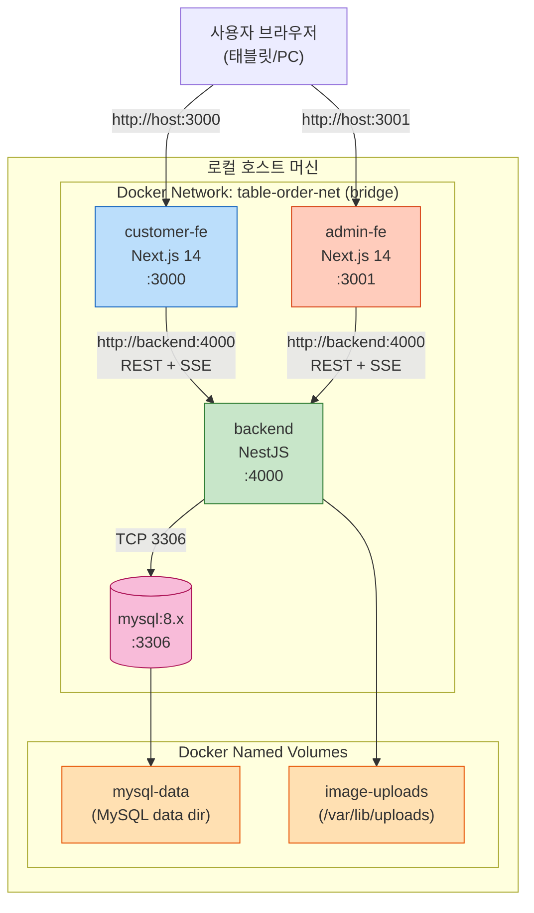

# Shared Infrastructure Design (one-shot)

**Scope**: 전체 프로젝트 공통 인프라 (Workflow Planning에서 one-shot으로 결정)
**Deployment Target**: 로컬 / Docker Compose 단일 머신 (Req Q2=A)
**Status**: Pending Approval

본 문서는 9개 Unit 전부가 의존하는 공통 인프라(Docker Compose 토폴로지·볼륨·네트워크·환경변수·포트)를 정의합니다. Unit별 Infrastructure Design은 수행하지 않습니다.

---

## 1. Deployment Architecture



---

## 2. Services 명세

| Service | Image | Internal Port | Host Port | Healthcheck | Depends On |
|---|---|---|---|---|---|
| `mysql` | `mysql:8.4` | 3306 | 3306 (옵션, 디버깅용) | `mysqladmin ping -h localhost` | — |
| `backend` | local build (`apps/backend/Dockerfile`) | 4000 | 4000 | `curl -f http://localhost:4000/health` | `mysql (healthy)` |
| `customer-fe` | local build (`apps/customer-fe/Dockerfile`) | 3000 | 3000 | (Next.js 자체) | `backend (started)` |
| `admin-fe` | local build (`apps/admin-fe/Dockerfile`) | 3001 | 3001 | (Next.js 자체) | `backend (started)` |

**시작 순서**: `mysql (healthy)` → `backend (healthy)` → `customer-fe` + `admin-fe`

---

## 3. Docker Compose 스켈레톤 (`docker-compose.yml`)

```yaml
# 실제 파일은 U9 단계에서 생성. 본 문서는 설계 명세.
version: '3.9'

networks:
  table-order-net:
    driver: bridge

volumes:
  mysql-data:
  image-uploads:

services:
  mysql:
    image: mysql:8.4
    container_name: to-mysql
    restart: unless-stopped
    environment:
      MYSQL_ROOT_PASSWORD: ${MYSQL_ROOT_PASSWORD}
      MYSQL_DATABASE: ${MYSQL_DATABASE}
      MYSQL_USER: ${MYSQL_USER}
      MYSQL_PASSWORD: ${MYSQL_PASSWORD}
      TZ: Asia/Seoul
    volumes:
      - mysql-data:/var/lib/mysql
    ports:
      - "3306:3306"          # 디버깅용, 운영 전환 시 제거 권장
    networks: [ table-order-net ]
    healthcheck:
      test: ["CMD", "mysqladmin", "ping", "-h", "localhost", "-uroot", "-p${MYSQL_ROOT_PASSWORD}"]
      interval: 10s
      timeout: 5s
      retries: 5

  backend:
    build:
      context: .
      dockerfile: apps/backend/Dockerfile
    container_name: to-backend
    restart: unless-stopped
    environment:
      NODE_ENV: production
      PORT: 4000
      DB_HOST: mysql
      DB_PORT: 3306
      DB_NAME: ${MYSQL_DATABASE}
      DB_USER: ${MYSQL_USER}
      DB_PASSWORD: ${MYSQL_PASSWORD}
      JWT_SECRET: ${JWT_SECRET}
      JWT_ADMIN_EXPIRES_IN: 16h
      TABLE_TOKEN_EXPIRES_IN: 90d
      IMAGE_UPLOAD_DIR: /var/lib/uploads
      STATIC_BASE_URL: http://localhost:4000
      CORS_ORIGINS: http://localhost:3000,http://localhost:3001
      TZ: Asia/Seoul
    volumes:
      - image-uploads:/var/lib/uploads
    ports:
      - "4000:4000"
    networks: [ table-order-net ]
    depends_on:
      mysql:
        condition: service_healthy
    healthcheck:
      test: ["CMD-SHELL", "wget -q --spider http://localhost:4000/health || exit 1"]
      interval: 10s
      timeout: 3s
      retries: 5

  customer-fe:
    build:
      context: .
      dockerfile: apps/customer-fe/Dockerfile
    container_name: to-customer-fe
    restart: unless-stopped
    environment:
      NODE_ENV: production
      PORT: 3000
      NEXT_PUBLIC_API_URL: http://localhost:4000
      NEXT_PUBLIC_SSE_URL: http://localhost:4000/sse/stream
      TZ: Asia/Seoul
    ports:
      - "3000:3000"
    networks: [ table-order-net ]
    depends_on: [ backend ]

  admin-fe:
    build:
      context: .
      dockerfile: apps/admin-fe/Dockerfile
    container_name: to-admin-fe
    restart: unless-stopped
    environment:
      NODE_ENV: production
      PORT: 3001
      NEXT_PUBLIC_API_URL: http://localhost:4000
      NEXT_PUBLIC_SSE_URL: http://localhost:4000/sse/stream
      TZ: Asia/Seoul
    ports:
      - "3001:3001"
    networks: [ table-order-net ]
    depends_on: [ backend ]
```

> **Note**: `NEXT_PUBLIC_*` 환경변수는 **빌드 타임**에 inline 되므로, 실제 호스트(예: 매장 PC IP)에 배포 시 빌드 시점에 주입 필요. 로컬 개발은 `localhost` 기본값.

---

## 4. Volumes

| Volume | 마운트 대상 | 목적 | 백업 권장 |
|---|---|---|---|
| `mysql-data` | `/var/lib/mysql` (in mysql container) | 영속 DB 데이터 | ✅ |
| `image-uploads` | `/var/lib/uploads` (in backend container) | 메뉴 이미지 원본 | ✅ |

**중요**: `image-uploads`를 named volume으로 명시하지 않으면 컨테이너 재배포 시 이미지 유실 (RISK-02).

백업 가이드 (U9에서 스크립트 제공):
- `docker run --rm -v table-order_mysql-data:/data -v $(pwd):/backup alpine tar czf /backup/mysql-data.tgz -C /data .`
- `docker run --rm -v table-order_image-uploads:/data -v $(pwd):/backup alpine tar czf /backup/images.tgz -C /data .`

---

## 5. Networking

| 영역 | 구성 |
|---|---|
| 컨테이너 간 통신 | Docker bridge network `table-order-net` (서비스명 DNS 자동) |
| 외부 → 컨테이너 | 호스트 포트 매핑 (3000/3001/4000/3306) |
| CORS | Backend → `http://localhost:3000`, `http://localhost:3001` 허용 |
| HTTPS | 미적용 (로컬). 운영 전환 시 reverse proxy (Caddy/Nginx) 권장 |

---

## 6. Environment Variables (`.env.example`)

```dotenv
# MySQL
MYSQL_ROOT_PASSWORD=changeme_root
MYSQL_DATABASE=table_order
MYSQL_USER=tableorder
MYSQL_PASSWORD=changeme_app

# Backend
JWT_SECRET=replace-with-64-byte-random-string
# (생성 예: openssl rand -hex 32)

# (frontend NEXT_PUBLIC_*는 docker-compose에 inline; 빌드 시점에 주입)
```

**.env 관리 룰**:
- `.env.example` 만 커밋 (실제 `.env`는 `.gitignore`)
- `JWT_SECRET`은 ≥ 64 byte 랜덤
- 운영 전환 시 secret manager (Docker secret / Vault) 고려 — MVP는 .env

---

## 7. Logging / Observability (최소 수준)

| 항목 | 적용 |
|---|---|
| Backend 로그 | stdout JSON (NFR-OBS-01) — `docker logs to-backend` |
| MySQL slow log | 미적용 (MVP) |
| 메트릭 | 미적용 (Resiliency baseline OFF) |
| 트레이싱 | 미적용 |
| 헬스체크 | `/health` (backend), `mysqladmin ping` (mysql) |

운영 전환 시 추가 검토:
- Datadog / Grafana / Sentry 등 도입 (constraints에는 미포함, 후속 결정)

---

## 8. Compute Sizing (Local PoC 기준)

| Service | CPU 권장 | Memory 권장 | 비고 |
|---|---|---|---|
| mysql | 1 core | 512MB~1GB | 매장당 데이터 수십MB 가정 |
| backend | 0.5 core | 256~512MB | NestJS Node.js |
| customer-fe | 0.25 core | 256MB | Next.js standalone |
| admin-fe | 0.25 core | 256MB | Next.js standalone |
| **합계** | **~2 cores** | **~1.5~2.5GB** | 일반 노트북에서 동작 가능 |

---

## 9. Storage Lifecycle

| 데이터 종류 | 보존 정책 |
|---|---|
| Order / OrderItem | 무기한 (정산·통계 목적) |
| TableSession | 무기한 |
| 이미지 파일 | 메뉴 삭제 시 orphan 가능 — MVP는 수동 정리, 후속 cleanup job |
| 로그 | docker logs 기본 (rolling). 운영 시 max-size 옵션 권장 |

---

## 10. Security Notes (MVP 수준)

| 항목 | 적용 |
|---|---|
| MySQL root 접근 | 호스트 3306 노출 — 운영 시 제거 또는 firewall |
| JWT_SECRET | .env 외부화 |
| 비밀번호 저장 | bcrypt (NFR-SEC-01) |
| 입력 검증 | NestJS ValidationPipe (전역) |
| HTTPS | 미적용 (로컬). 운영 시 reverse proxy 권장 |
| Rate limit | 미적용 (Security baseline OFF) |
| **참고** | Security extension OFF (Q16=B). 위 항목은 기본 위생 |

---

## 11. Disaster Recovery / Backup

| 시나리오 | 대응 |
|---|---|
| 컨테이너 재시작 | `restart: unless-stopped` 자동 |
| 호스트 재부팅 | Docker daemon 자동 시작 시 컨테이너 자동 재기동 |
| MySQL 데이터 손상 | `mysql-data` 볼륨 백업본 복원 (U9에서 backup script 제공) |
| 이미지 파일 손상 | `image-uploads` 볼륨 백업본 복원 |
| 호스트 머신 장애 | (MVP 범위 외) — 운영 전환 시 클라우드 백업 |

---

## 12. Deployment Architecture 산출물

본 디자인은 **shared infrastructure**로서 U9 Unit이 다음을 산출:

- [ ] `docker-compose.yml` (본 §3 기반)
- [ ] `apps/backend/Dockerfile` (Node 20 + pnpm + build + run)
- [ ] `apps/customer-fe/Dockerfile` (Next.js standalone)
- [ ] `apps/admin-fe/Dockerfile` (동일)
- [ ] `.env.example`
- [ ] `.gitignore` (`.env`, `node_modules`, `.next`, `dist` 등)
- [ ] `scripts/backup.sh`, `scripts/restore.sh` (단순)
- [ ] `README.md` 의 "Run locally" 섹션

U1 단계에서는 본 Infrastructure Design의 환경변수·연결 정보를 기반으로 Backend의 `config/` 모듈을 작성합니다.

---

## 13. Validation Checklist

| 항목 | 결과 |
|---|---|
| 모든 서비스 컨테이너화 | ✅ 4 서비스 |
| 영속 데이터 named volume | ✅ 2 볼륨 |
| 시작 순서 healthcheck 기반 | ✅ |
| Env vars 외부화 | ✅ .env.example |
| 컨테이너 간 internal DNS 사용 | ✅ (`mysql`, `backend` 서비스명) |
| CORS 적용 | ✅ Backend |
| TZ 통일 | ✅ Asia/Seoul (4 서비스) |
| Extension(Resiliency OFF) 반영 | ✅ HA/Auto-scaling 미적용 |
| 단일 매장 PoC 가정 | ✅ |
