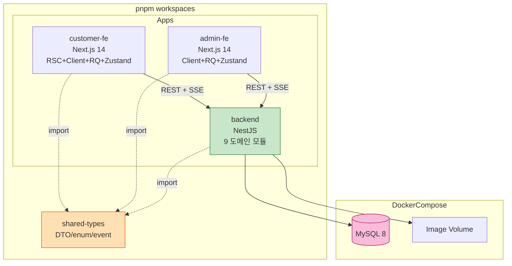

# Application Design — 통합 문서

본 문서는 **테이블오더 서비스 (Greenfield, 단일 매장 PoC)** 의 high-level application design을 통합 정리합니다. 세부는 각 sub-문서를 참조하세요.

| 영역 | 문서 |
|---|---|
| 컴포넌트 정의 / 디렉토리 구조 | [`components.md`](./components.md) |
| 메서드 시그니처 (I/O) | [`component-methods.md`](./component-methods.md) |
| 서비스 책임·오케스트레이션 | [`services.md`](./services.md) |
| 의존·통신 패턴·데이터 흐름 | [`component-dependency.md`](./component-dependency.md) |

---

## 1. Architectural Decisions (Requirements + Plan 답변 기반)

| 영역 | 결정 | 출처 |
|---|---|---|
| Monorepo | **pnpm workspaces** (`apps/customer-fe`, `apps/admin-fe`, `apps/backend`, `packages/shared-types`) | Q1=A |
| Backend 조직 | **NestJS 모듈(도메인별) + Layer 기반 내부 폴더** (controllers/services/repositories/entities) | Q2=B |
| ORM | **TypeORM** + mysql2 | Q3=B |
| Frontend 패턴 | **혼합** — 정적/SEO는 RSC, 인터랙티브/실시간은 Client + React Query + Zustand | Q4=C |
| 실시간 토폴로지 | **NestJS EventEmitter (in-process)** + SSE | Q5=A |
| API 계약 | **OpenAPI(Swagger) 자동 + shared-types 수동 import** | Q6=A |
| i18n | `next-intl` 구조만 적용, 한국어 단일 | Req Q14=B |
| 이미지 저장 | 서버 로컬 디스크 + Docker volume + `serveStatic` | Req Q6=B |
| Auth (Admin) | JWT 16h, localStorage, bcrypt | Req Q9=B, Q10=C |
| Auth (Table) | Long-lived 테이블 토큰, localStorage | Req Q11=B |

---

## 2. 컴포넌트 한눈에 보기

---

## 3. Backend 도메인 모듈 (9개)

| 모듈 | 책임 요약 | 주요 Service |
|---|---|---|
| Auth | Admin/Table 인증·토큰·Guard | AuthService |
| Store | 매장 마스터 | StoreService |
| Category | 카테고리 CRUD + sortOrder | CategoryService |
| Menu | 메뉴 CRUD + sortOrder + 카테고리 조회 | MenuService |
| Image | 이미지 업로드 + 정적 서빙 | ImageService |
| Order | 주문 생성/조회/상태/취소 | OrderService |
| Session | 테이블 세션 라이프사이클 + 과거 이력 | SessionService |
| Realtime | EventEmitter + SSE Observable | RealtimeService |
| Common | 전역 필터/인터셉터/파이프/데코레이터 | (전역) |

상세: [`components.md` §4](./components.md), [`services.md` §1](./services.md)

---

## 4. 도메인 엔티티 (DB 테이블 후보)

| Entity | 핵심 필드 |
|---|---|
| Store | id, name, code |
| AdminUser | id, storeId, username, passwordHash |
| Table | id, storeId, tableNumber, passwordHash |
| Category | id, storeId, name, sortOrder |
| Menu | id, storeId, categoryId, name, price, description, imageUrl, sortOrder, isActive |
| TableSession | id, tableId, startedAt, endedAt |
| Order | id, sessionId, tableId, orderNumber, totalAmount, status, createdAt, canceledAt |
| OrderItem | id, orderId, menuId, menuNameSnapshot, unitPriceSnapshot, quantity |

상세 필드 / 제약 / 인덱스는 후속 **Functional Design (per-unit)** 에서 unit별 ERD 작성.

---

## 5. 인터페이스 요약 (REST + SSE)

### 5.1 REST 엔드포인트 (요약)

| Route | Method | Guard | Persona |
|---|---|---|---|
| `/auth/admin/login` | POST | — | Admin |
| `/auth/table/setup` | POST | JwtAdminGuard | Admin (Customer 태블릿 초기 등록) |
| `/categories` | GET / POST / PATCH / DELETE / PATCH /reorder | (read public/optional) / JwtAdminGuard | Customer read + Admin write |
| `/menus` | GET / POST / PATCH / DELETE / PATCH /reorder | (read) / JwtAdminGuard | Customer read + Admin write |
| `/menus/by-category/:id` | GET | (read) | Both |
| `/images/upload` | POST (multipart) | JwtAdminGuard | Admin |
| `/orders` | POST | TableTokenGuard | Customer |
| `/orders/current` | GET | TableTokenGuard | Customer |
| `/orders` | GET | JwtAdminGuard | Admin |
| `/orders/:id/status` | PATCH | JwtAdminGuard | Admin |
| `/orders/:id` | DELETE | JwtAdminGuard | Admin |
| `/tables` | GET / POST | JwtAdminGuard | Admin |
| `/tables/:id/end-session` | POST | JwtAdminGuard | Admin |
| `/tables/:id/history` | GET | JwtAdminGuard | Admin |
| `/sse/stream` | GET (text/event-stream) | JwtAdmin or TableToken | Both |

### 5.2 SSE 이벤트 (4종)

| Event | Trigger | Subscribers |
|---|---|---|
| ORDER_CREATED | OrderService.create | Admin dashboard / Customer 같은 테이블 |
| ORDER_STATUS_CHANGED | OrderService.changeStatus | Customer 내역 / 다른 Admin |
| ORDER_CANCELED | OrderService.cancel | Customer / Admin |
| SESSION_ENDED | SessionService.end | Customer / Admin |

---

## 6. 데이터 흐름 핵심 시나리오

1. **주문 골든 플로우** — Cart → POST /orders → Session 보장 → DB → SSE → Admin 대시보드 (≤ 2초)
2. **상태 변경** — Admin → PATCH → DB → SSE → Customer 내역
3. **세션 종료** — Admin → POST end-session → DB → SSE → 양 FE 갱신
4. **자동 로그인** — Customer FE → localStorage 토큰 검증 → 401이면 setup 화면

상세 시퀀스: [`services.md` §2](./services.md), [`component-dependency.md` §4-6](./component-dependency.md)

---

## 7. 횡단 관심사 (Cross-cutting Concerns)

| 관심사 | 적용 위치 | 패턴 |
|---|---|---|
| 인증 | NestJS Guards (JwtAdminGuard / TableTokenGuard) | Decorator + Guard |
| 입력 검증 | NestJS ValidationPipe + class-validator | DTO 기반 자동 |
| 에러 응답 통일 | HttpExceptionFilter (전역) | `{ error: { code, message, details? } }` |
| 로깅 | LoggingInterceptor + 구조화 JSON 로그 | request id, latency, status |
| 트랜잭션 | TypeORM `DataSource.transaction()` | 주문 생성 / 카테고리 삭제 등 |
| CORS | `app.enableCors({ origin })` | Customer FE / Admin FE 도메인 허용 |
| Static serving | `ServeStaticModule` | `/static/uploads/*` |

---

## 8. 페르소나 ↔ 모듈 ↔ Story 매핑 요약

| 페르소나 | 주요 모듈 | Epic |
|---|---|---|
| Customer (민준) | Auth (Table), Menu (read), Order, Session (read), Realtime (subscribe) | C1~C5 |
| Admin (지우) | Auth (Admin), Category, Menu (write), Image, Order (admin), Session (write), Realtime (subscribe) | A1~A6 |
| (System) | Order, Session, Realtime 의 자동 행위 | US-S-01~05 |

---

## 9. 후속 단계 입력

본 design 문서는 다음 단계의 입력으로 사용됩니다:

| 단계 | 사용 방식 |
|---|---|
| **Units Generation** | 모듈/도메인 매핑을 기반으로 9 Unit 분할 (U1 Foundation, U2 Auth, U3 Menu/Cat, U4 Browse, U5 Cart, U6 Order+Session, U7 History, U8 Realtime, U9 Infra) |
| **Functional Design** (per-unit) | Service 메서드의 비즈니스 룰·전이 검증·트랜잭션 디테일 |
| **NFR Requirements/Design** (per-unit) | Auth/Order/Realtime Unit에서 성능·보안 NFR 명시 |
| **Infrastructure Design** | Docker Compose 토폴로지, 볼륨, 환경변수 |
| **Code Generation** | 본 디렉토리 구조·시그니처 그대로 골격 생성 |

---

## 10. Validation Checklist

| 항목 | 결과 |
|---|---|
| 모든 FR이 모듈에 매핑됨 | ✅ (FR-CUS-01~05 / FR-ADM-01~06 / FR-SYS-01~03) |
| 모든 user story가 컴포넌트/서비스에 도달 가능 | ✅ |
| 두 페르소나의 인증 흐름 분리됨 | ✅ (JwtAdminGuard / TableTokenGuard) |
| SSE 이벤트 카탈로그가 비즈니스 이벤트와 일치 | ✅ (4종) |
| 순환 의존 없음 | ✅ |
| shared-types에 런타임 로직 없음 | ✅ (interface/enum/type만) |
| 트랜잭션 경계 명시 | ✅ |
| Extension 결정 반영 | ✅ Security/Resiliency/PBT OFF — 본 design은 그에 맞춘 단순화 |
