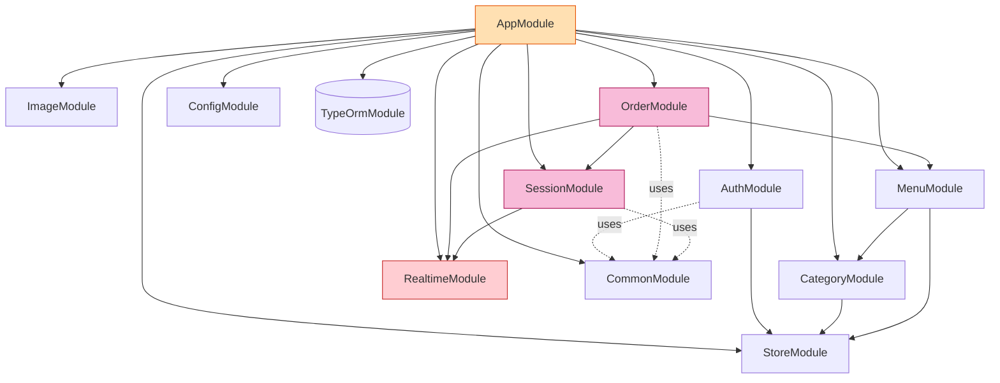
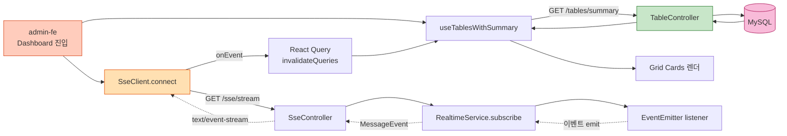
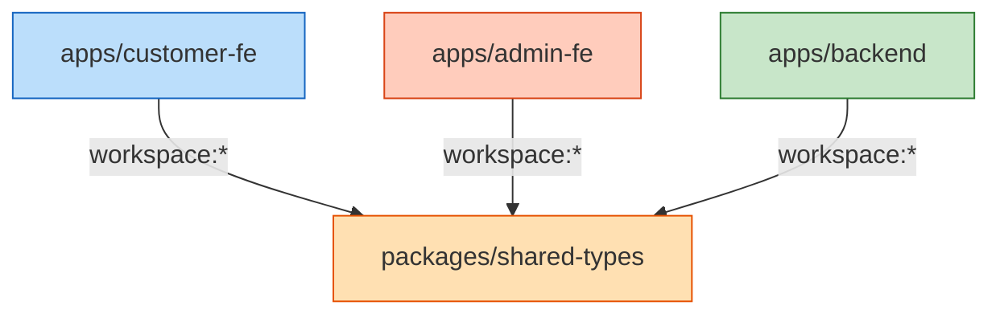

# Component Dependency — 의존 관계 및 통신 패턴

본 문서는 컴포넌트 간 **의존 관계 / 통신 패턴 / 데이터 흐름**을 정의합니다.

---

## 1. 모듈 의존 그래프 (Backend)



**핵심**:
- `OrderModule`은 `SessionModule`과 `RealtimeModule`에 의존 (주문 생성 시 세션 보장 + SSE publish)
- `SessionModule`은 `RealtimeModule`에 의존 (세션 종료 SSE)
- `RealtimeModule`은 다른 도메인 모듈에 의존하지 않음 (단방향)
- `MenuModule`은 `CategoryModule`에 의존 (FK 검증)
- `CommonModule`은 전역 (필터/인터셉터/파이프/데코레이터 제공)

---

## 2. 의존 매트릭스 (행이 열에 의존)

| / | Auth | Store | Category | Menu | Image | Order | Session | Realtime | Common |
|---|---|---|---|---|---|---|---|---|---|
| **Auth** | — | ✅ | | | | | | | uses |
| **Store** | | — | | | | | | | uses |
| **Category** | | ✅ | — | | | | | | uses |
| **Menu** | | ✅ | ✅ | — | | | | | uses |
| **Image** | | | | | — | | | | uses |
| **Order** | | ✅ | | ✅ | | — | ✅ | ✅ | uses |
| **Session** | | ✅ | | | | | — | ✅ | uses |
| **Realtime** | | | | | | | | — | uses |

순환 의존 없음.

---

## 3. 통신 패턴

### 3.1 외부 통신 (FE ↔ BE)

| 패턴 | 사용처 | 비고 |
|---|---|---|
| **REST (JSON)** | 모든 CRUD, 인증, 주문 생성·조회·상태 변경 | NestJS 기본, `application/json` |
| **SSE (text/event-stream)** | 실시간 주문/상태/세션 이벤트 broadcast | `GET /sse/stream`, EventSource |
| **multipart/form-data** | 이미지 업로드 | `POST /images/upload` |
| **정적 파일** | 메뉴 이미지 서빙 | `GET /static/uploads/*`, NestJS `serveStatic` |

### 3.2 내부 통신 (Backend 모듈 간)

| 패턴 | 사용처 |
|---|---|
| **직접 DI 메서드 호출** | 모든 Service ↔ Service (Order → Session, Order → Menu 등) |
| **NestJS EventEmitter** | RealtimeService publish ↔ subscribe (in-process) |
| **TypeORM Repository** | Service ↔ DB (모든 read/write) |

### 3.3 Backend ↔ Infrastructure

| 패턴 | 사용처 |
|---|---|
| **TypeORM + mysql2 드라이버** | MySQL connection pool |
| **Node.js fs (Multer)** | 이미지 업로드 → Docker volume `/var/lib/images/uploads/` |

---

## 4. 데이터 흐름 — 주문 골든 플로우

```mermaid
flowchart LR
    subgraph CFE["customer-fe"]
        UI1[Menu Screen] --> UI2[Add to Cart]
        UI2 --> ZS[Zustand cart-store<br/>+localStorage]
        ZS --> UI3[Checkout]
        UI3 --> RQ[useCreateOrder<br/>React Query]
    end
    RQ -->|POST /orders<br/>Bearer tableToken| C[OrderController]
    C --> OS[OrderService.create]
    OS --> SS[SessionService.ensureActiveSession]
    SS --> DB[(MySQL)]
    OS --> MS[MenuService<br/>가격·이름 스냅샷]
    MS --> DB
    OS --> DB
    OS --> RS[RealtimeService.publishOrderCreated]
    RS --> EE[NestJS<br/>EventEmitter]
    EE --> SSE[SSE /sse/stream]
    SSE --> AFE[admin-fe<br/>Dashboard]
    AFE --> AFE_INV[React Query invalidate<br/>useTablesWithSummary]
    AFE_INV -->|GET /tables/summary| C2[TableController]
    C2 --> DB

    OS -->|Order| C
    C -->|201 Order| RQ
    RQ --> UI4[Order Success UI<br/>+ Cart clear<br/>+ 5s redirect]

    style CFE fill:#BBDEFB,stroke:#1565C0
    style AFE fill:#FFCCBC,stroke:#D84315
    style DB fill:#F8BBD9,stroke:#AD1457
    style SSE fill:#FFE0B2,stroke:#E65100
```



---

## 5. 데이터 흐름 — Admin 대시보드 실시간



---

## 6. 데이터 흐름 — 테이블 자동 로그인 (재방문 시)

```mermaid
flowchart TD
    Start([Customer FE 로드]) --> Q1{localStorage<br/>table_token?}
    Q1 -->|없음| Setup[Setup Form<br/>POST /auth/table/setup<br/>JwtAdminGuard 필요]
    Q1 -->|있음| Q2{토큰 유효<br/>(API 시도)?}
    Q2 -->|401| Clear[토큰 제거] --> Setup
    Q2 -->|200| Menu[Menu Screen]

    Setup --> Reg[테이블 등록 완료<br/>tableToken 발급]
    Reg --> Save[localStorage 저장] --> Menu

    style Start fill:#CE93D8,stroke:#6A1B9A
    style Menu fill:#C8E6C9,stroke:#2E7D32
    style Setup fill:#FFA726,stroke:#E65100
```

**주의**: 테이블 등록(`POST /auth/table/setup`)은 **Admin 인증이 필요**합니다. 즉 매장 운영자가 한 번 등록한 태블릿이 이후 토큰만으로 자동 로그인. Customer 본인이 setup 폼을 채우는 것이 아니라 **최초 1회 Admin이 등록**하는 흐름.

---

## 7. 패키지 의존 (Monorepo)



- `shared-types` 는 의존이 없음 (순수 타입)
- 3개 앱은 모두 `shared-types`에 의존
- 앱 간 직접 의존 없음 (FE ↔ BE는 HTTP/SSE)

---

## 8. 환경 / 인프라 의존

| 컴포넌트 | 의존 |
|---|---|
| `customer-fe` | Node.js 20+, Backend `NEXT_PUBLIC_API_URL` 환경변수 |
| `admin-fe` | Node.js 20+, Backend `NEXT_PUBLIC_API_URL` 환경변수 |
| `backend` | Node.js 20+, MySQL 8.x, Image volume mount, `.env` (JWT_SECRET, DB_*, IMAGE_DIR) |
| `mysql` | Docker image `mysql:8`, volume `mysql-data`, init SQL (seed) |

**Docker Compose 시작 순서**: `mysql` → `backend` (depends_on with healthcheck) → `customer-fe` / `admin-fe`

---

## 9. 변경 시 영향 매트릭스 (참고)

| 변경 영역 | 직접 영향 | 간접 영향 |
|---|---|---|
| Menu 스키마 변경 | MenuModule, shared-types Menu DTO | OrderItem 스냅샷 / Customer 메뉴 화면 / Admin 메뉴 관리 |
| Order 상태 추가 | OrderStatus enum, OrderService 전이 룰 | shared-types, Admin 상태 변경 UI, Customer 표시 |
| SSE 이벤트 추가 | SseEventType enum, RealtimeService publish 메서드, SseClient handler | shared-types Event payload, FE invalidation 로직 |
| JWT 만료 시간 변경 | AuthService config | 클라이언트 토큰 갱신 로직 (현재 16h 고정) |
| 매장 모델 확장 (멀티 매장) | StoreService, 모든 Repository에 storeId 필터 (이미 적용 중) | 단일 매장 가정한 부분(시드, 인증 흐름) 검토 |

---

## 10. Anti-patterns / 가드레일

| Don't | Why |
|---|---|
| Service에서 다른 모듈의 Repository를 직접 import | 모듈 캡슐화 위반. Service만 의존 |
| SSE publish를 트랜잭션 안에서 호출 | rollback 시 ghost 이벤트 |
| Order 트랜잭션 안에서 Image 업로드 호출 | 파일 IO는 별도 흐름 (이미지는 메뉴 관리 시점에만) |
| Customer FE에서 Admin API 호출 | 권한 분리 — guard 다름 |
| shared-types에 런타임 로직(class with method) 포함 | 트리쉐이킹 / 호환성 — interface/enum/type만 |
