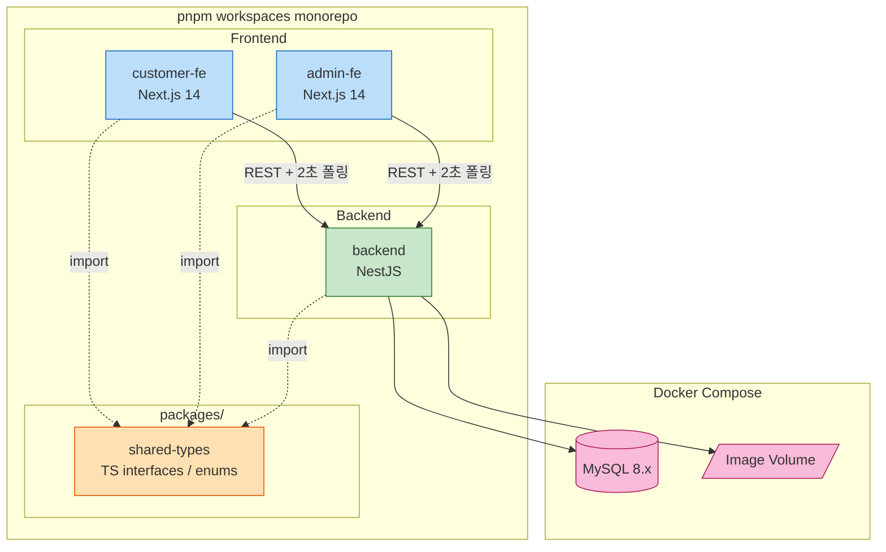

# Components — 테이블오더 서비스

본 문서는 시스템의 **주요 컴포넌트**와 각 컴포넌트의 **책임 / 인터페이스**를 정의합니다. 상세 메서드 시그니처는 `component-methods.md`, 비즈니스 룰은 Functional Design(per-unit)에서 다룹니다.

---

## 1. 시스템 컴포넌트 개요



---

## 2. 패키지 구조 (Monorepo Top-level)

```
table-order/
├── apps/
│   ├── customer-fe/        # Next.js 14 — Customer 태블릿 UI
│   ├── admin-fe/           # Next.js 14 — Admin 운영자 UI
│   └── backend/            # NestJS — REST + DB (실시간은 클라이언트 폴링)
├── packages/
│   └── shared-types/       # FE/BE 공유 TS 타입 (DTO, enum, event payload)
├── docker-compose.yml
├── pnpm-workspace.yaml
├── package.json
└── README.md
```

---

## 3. Frontend 컴포넌트

### 3.1 `customer-fe` (Customer Web App)

**목적**: 테이블 태블릿에서 고객이 메뉴 탐색 + 주문 + 내역 확인

**기술 스택**: Next.js 14 (App Router) + TypeScript + TailwindCSS + React Query(TanStack) + Zustand + next-intl

**아키텍처**: 혼합 패턴 (Q4=C)
- **RSC (Server Components)**: 메뉴 카테고리 리스트 등 정적 데이터 (캐시 + revalidate)
- **Client Components + React Query**: 장바구니, 주문 생성, 주문 내역(2초 폴링)

**핵심 책임**:
- 테이블 인증/세션 토큰 관리 (localStorage)
- 메뉴 데이터 패칭 및 카테고리별 표시
- 장바구니 상태 관리 (localStorage 영속화)
- 주문 생성 및 결과 처리
- 현재 세션 주문 내역 조회
- (선택) 폴링(2초) 기반 주문 상태 주기적 갱신

**디렉토리 구조**:
```
apps/customer-fe/
├── src/
│   ├── app/
│   │   ├── layout.tsx              # Root layout, providers (RQ, Zustand)
│   │   ├── page.tsx                # 자동 로그인 + 메뉴 화면
│   │   ├── setup/page.tsx          # 초기 설정 폼
│   │   ├── cart/page.tsx           # 장바구니 확인
│   │   ├── checkout/page.tsx       # 주문 확정 + 성공 화면
│   │   ├── history/page.tsx        # 주문 내역
│   │   └── api/                    # (사용 시) BFF route handler
│   ├── components/
│   │   ├── menu/                   # MenuCard, CategoryTabs, MenuDetail
│   │   ├── cart/                   # CartItem, CartSummary, AddToCartButton
│   │   ├── order/                  # OrderConfirmation, OrderSuccess, OrderItem
│   │   └── shared/                 # Button, Modal, Spinner
│   ├── lib/
│   │   ├── api-client.ts           # fetch 래퍼 (Authorization 헤더 자동 부착)
│   │   ├── auth.ts                 # 테이블 토큰 저장/조회/제거
│   │   ├── i18n.ts                 # next-intl 설정
│   │   └── queries/                # React Query useXxx hooks
│   ├── stores/
│   │   └── cart-store.ts           # Zustand 장바구니 상태 + persist 미들웨어
│   └── styles/
└── next.config.js / tsconfig.json
```

### 3.2 `admin-fe` (Admin Web App)

**목적**: 매장 운영자의 실시간 주문 모니터링 + 테이블/메뉴/카테고리 관리

**기술 스택**: customer-fe와 동일

**아키텍처**: 혼합 (Q4=C) — 메뉴/카테고리 관리는 RSC fallback 가능, 대시보드/실시간은 client + RQ

**핵심 책임**:
- 매장 인증 (로그인 + JWT localStorage)
- 그리드 대시보드 (테이블별 카드)
- 2초 폴링 + 폴링 diff 기반 신규 주문 시각 강조
- 주문 상세 보기 + 상태 변경 + 삭제(soft-delete)
- 테이블 등록 + 세션 종료
- 메뉴/카테고리/이미지 CRUD

**디렉토리 구조**:
```
apps/admin-fe/
├── src/
│   ├── app/
│   │   ├── layout.tsx
│   │   ├── login/page.tsx
│   │   ├── (dashboard)/
│   │   │   ├── layout.tsx          # 인증 가드 + 사이드바
│   │   │   ├── page.tsx            # 그리드 대시보드(메인)
│   │   │   ├── tables/page.tsx     # 테이블 등록/관리
│   │   │   ├── tables/[id]/history/page.tsx
│   │   │   ├── menus/page.tsx      # 메뉴 CRUD
│   │   │   ├── categories/page.tsx # 카테고리 CRUD
│   │   │   └── orders/[id]/page.tsx # 주문 상세 (모달 대체 가능)
│   │   └── api/
│   ├── components/
│   │   ├── dashboard/              # TableCard, OrderPreview, StatusBadge
│   │   ├── table/                  # TableRegisterForm, EndSessionButton
│   │   ├── menu/                   # MenuForm, MenuList, SortHandle
│   │   ├── category/               # CategoryForm, CategoryList
│   │   └── shared/                 # AppBar, Sidebar, Modal, Toast
│   ├── lib/
│   ├── stores/
│   │   └── auth-store.ts           # admin JWT
│   └── styles/
```

---

## 4. Backend 컴포넌트 (NestJS, Layer-based 폴더 구조)

### 4.1 전체 구조

NestJS 모듈은 도메인별로 분리하되, 각 모듈 **내부 폴더 구조는 Layer 기반(Q2=B)**: `controllers/` / `services/` / `repositories/` / `entities/` / `dto/`.

```
apps/backend/
├── src/
│   ├── main.ts                     # 부트스트랩
│   ├── app.module.ts               # 루트 모듈
│   ├── auth/
│   │   ├── auth.module.ts
│   │   ├── controllers/auth.controller.ts
│   │   ├── services/auth.service.ts
│   │   ├── services/jwt.service.ts
│   │   ├── repositories/admin-user.repository.ts
│   │   ├── entities/admin-user.entity.ts
│   │   ├── entities/table.entity.ts
│   │   ├── dto/login.dto.ts
│   │   ├── dto/setup-table.dto.ts
│   │   ├── guards/jwt-admin.guard.ts
│   │   └── guards/table-token.guard.ts
│   ├── store/
│   │   ├── store.module.ts
│   │   ├── entities/store.entity.ts
│   │   └── services/store.service.ts
│   ├── menu/
│   │   ├── menu.module.ts
│   │   ├── controllers/menu.controller.ts
│   │   ├── services/menu.service.ts
│   │   ├── repositories/menu.repository.ts
│   │   ├── entities/menu.entity.ts
│   │   └── dto/{create,update}-menu.dto.ts
│   ├── category/
│   │   ├── category.module.ts
│   │   ├── controllers/category.controller.ts
│   │   ├── services/category.service.ts
│   │   ├── repositories/category.repository.ts
│   │   ├── entities/category.entity.ts
│   │   └── dto/
│   ├── image/
│   │   ├── image.module.ts
│   │   ├── controllers/image.controller.ts
│   │   ├── services/image.service.ts
│   │   └── multer.config.ts
│   ├── order/
│   │   ├── order.module.ts
│   │   ├── controllers/order.controller.ts
│   │   ├── services/order.service.ts
│   │   ├── repositories/order.repository.ts
│   │   ├── entities/order.entity.ts
│   │   ├── entities/order-item.entity.ts
│   │   ├── enums/order-status.enum.ts
│   │   └── dto/
│   ├── session/
│   │   ├── session.module.ts
│   │   ├── services/session.service.ts
│   │   ├── repositories/session.repository.ts
│   │   └── entities/table-session.entity.ts
│   ├── table/                              # Admin 테이블 조회/대시보드 집계 (폴링 대상)
│   │   ├── table.module.ts
│   │   ├── controllers/table.controller.ts # GET /tables, /summary, /:id/current-orders, /:id/history, POST /:id/end-session
│   │   └── services/table.service.ts       # listTables / buildSummaries
│   │   # (realtime/ 모듈 제거 — SSE 폐기, 폴링 전환)
│   ├── common/
│   │   ├── filters/http-exception.filter.ts
│   │   ├── interceptors/logging.interceptor.ts
│   │   ├── pipes/validation.pipe.ts
│   │   └── decorators/{store-id,table,admin-user}.decorator.ts
│   ├── config/
│   │   ├── typeorm.config.ts
│   │   ├── jwt.config.ts
│   │   └── env.validation.ts
│   └── migrations/
└── ormconfig / nest-cli / package.json
```

### 4.2 NestJS 모듈별 책임

| 모듈 | 책임 | 주요 엔드포인트 |
|---|---|---|
| **AuthModule** | Admin 로그인/JWT 발급 / Table 토큰 발급/검증 / Guards 제공 | `POST /auth/admin/login`, `POST /auth/table/setup` |
| **StoreModule** | 매장(단일 매장) 마스터 데이터 | 내부 사용 (seed) |
| **CategoryModule** | 카테고리 CRUD + sortOrder | `GET/POST/PATCH/DELETE /categories` |
| **MenuModule** | 메뉴 CRUD + sortOrder + 카테고리 조회 | `GET/POST/PATCH/DELETE /menus`, `GET /menus/by-category/:id` |
| **ImageModule** | 이미지 업로드 + 정적 서빙 URL 반환 | `POST /images/upload` |
| **OrderModule** | 주문 생성 / 조회 / 상태 변경(비관적 락) / soft-delete | `POST /orders`, `GET /orders/current`, `PATCH /orders/:id/status`, `DELETE /orders/:id` |
| **SessionModule** | 테이블 세션 시작 트리거 / 종료 | (내부 — TableController가 노출) |
| **TableModule** | 테이블 목록 / 대시보드 요약(폴링) / 현재주문 / 과거이력 / 세션종료 | `GET /tables`, `GET /tables/summary`, `GET /tables/:id/current-orders`, `GET /tables/:id/history`, `POST /tables/:id/end-session` |
| **CommonModule** | 전역 필터·인터셉터·파이프·데코레이터 | (전역) |

---

## 5. 공유 패키지 (`packages/shared-types`)

**목적**: FE/BE가 import 가능한 **순수 TypeScript 타입·enum·이벤트 페이로드** 정의. 런타임 로직은 포함하지 않음 (트리쉐이킹 보장).

```
packages/shared-types/
├── src/
│   ├── enums/
│   │   ├── order-status.ts         # PENDING / PREPARING / COMPLETED / CANCELED
│   │   └── sse-event-type.ts       # (DEPRECATED) SSE 폐기로 미사용 — U1 골격 잔존
│   ├── dto/
│   │   ├── auth.ts                 # AdminLoginRequest/Response, TableSetupRequest/Response
│   │   ├── menu.ts                 # Menu, CreateMenuRequest, UpdateMenuRequest
│   │   ├── category.ts             # Category, CreateCategoryRequest, ...
│   │   ├── order.ts                # Order, OrderItem, CreateOrderRequest, OrderListResponse
│   │   └── session.ts              # TableSession
│   ├── events/                     # (DEPRECATED) SSE 이벤트 페이로드 — 폴링 전환으로 미사용, U1 골격 잔존
│   │   ├── order-created.event.ts
│   │   ├── order-status-changed.event.ts
│   │   ├── order-canceled.event.ts
│   │   └── session-ended.event.ts
│   └── index.ts                    # public exports
├── package.json
└── tsconfig.json
```

**규칙**:
- 모든 BE DTO 클래스는 `shared-types` 인터페이스를 `implements` 또는 동일 구조로 작성
- 모든 FE API 클라이언트는 `shared-types` 타입을 사용
- 변경 시 BE/FE 빌드 시 타입 에러로 즉시 감지

---

## 6. 도메인 엔티티 개요 (DB 테이블 후보)

| Entity | 주요 필드 | 비고 |
|---|---|---|
| **Store** | id, name, code, createdAt | 단일 매장 — 행 1개만 (코드 기반 검증) |
| **AdminUser** | id, storeId, username, passwordHash, createdAt | Q1=A 단일 매장이라 매장-사용자 1:N (다중 계정 가능) |
| **Table** | id, storeId, tableNumber, passwordHash, createdAt | 매장 내 unique tableNumber |
| **Category** | id, storeId, name, sortOrder | unique (storeId, name) |
| **Menu** | id, storeId, categoryId, name, price, description, imageUrl, sortOrder, isActive | sortOrder 카테고리 내부 |
| **TableSession** | id, tableId, startedAt, endedAt | endedAt NULL = active |
| **Order** | id, sessionId, tableId, orderNumber, totalAmount, status, createdAt, canceledAt | status: PENDING/PREPARING/COMPLETED/CANCELED |
| **OrderItem** | id, orderId, menuId, menuNameSnapshot, unitPriceSnapshot, quantity | snapshot으로 메뉴 변경 영향 차단 |

---

## 7. 컴포넌트 인터페이스 (외부 노출 API 요약)

상세는 `component-methods.md` 참조. 여기서는 **REST 엔드포인트 그룹**만 요약.

| Route Prefix | Module | Guard | 페르소나 |
|---|---|---|---|
| `/auth/admin/*` | AuthModule | (none for login) | Admin |
| `/auth/table/*` | AuthModule | (none for setup) | Admin (setup) |
| `/categories` | CategoryModule | JwtAdminGuard | Admin |
| `/menus` | MenuModule | JwtAdminGuard (write) / public for read by Customer | Both |
| `/images/upload` | ImageModule | JwtAdminGuard | Admin |
| `/orders` (POST) | OrderModule | TableTokenGuard | Customer |
| `/orders/current` (GET) | OrderModule | TableTokenGuard | Customer |
| `/orders/:id/status` (PATCH) | OrderModule | JwtAdminGuard | Admin |
| `/orders/:id` (DELETE) | OrderModule | JwtAdminGuard | Admin |
| `/tables`, `/tables/summary` (GET) | TableModule | JwtAdminGuard | Admin |
| `/tables/:id/current-orders` (GET) | TableModule | JwtAdminGuard | Admin |
| `/tables/:id/end-session` (POST) | TableModule | JwtAdminGuard | Admin |
| `/tables/:id/history` (GET) | TableModule | JwtAdminGuard | Admin |
| ~~`/sse/stream`~~ | (제거 — SSE 폐기, 폴링 전환) | — | — |

---

## 8. 인프라 컴포넌트

| 컴포넌트 | 역할 | 비고 |
|---|---|---|
| **MySQL 8.x** | 영속 저장소 | Docker volume `mysql-data` |
| **Image Volume** | 메뉴 이미지 원본 | Docker volume `image-uploads`, 정적 서빙은 NestJS `serveStatic` |
| **Docker Network** | 컨테이너 간 통신 | 기본 bridge, 호스트 포트 매핑(3000/3001/4000/3306) |
