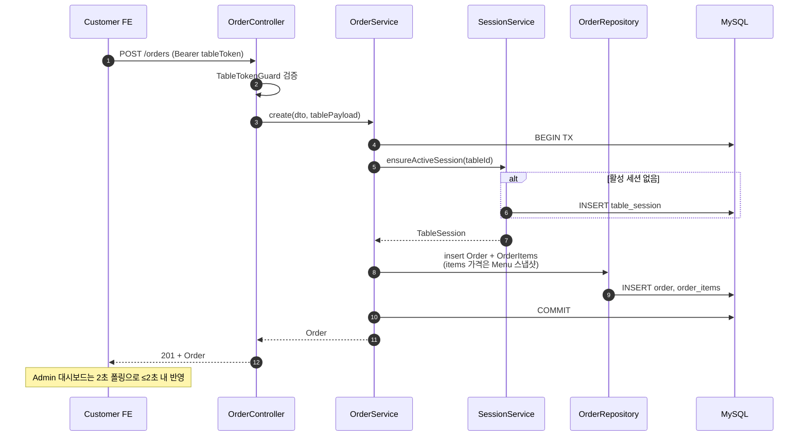
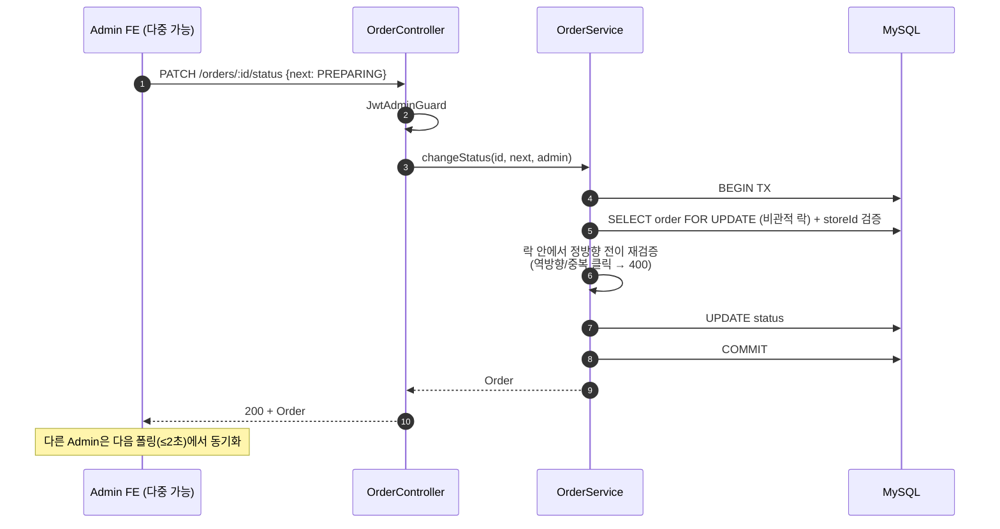
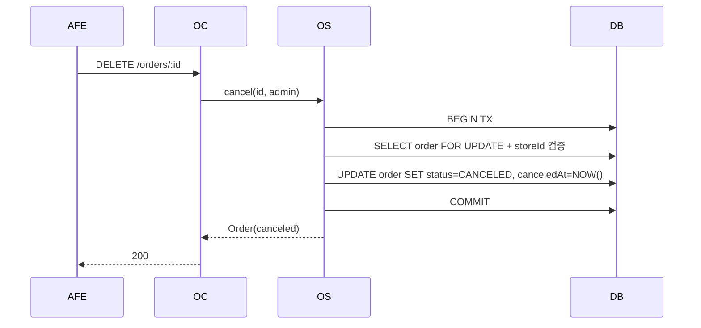
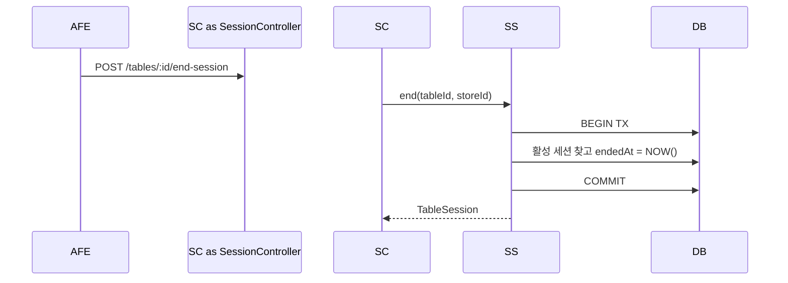
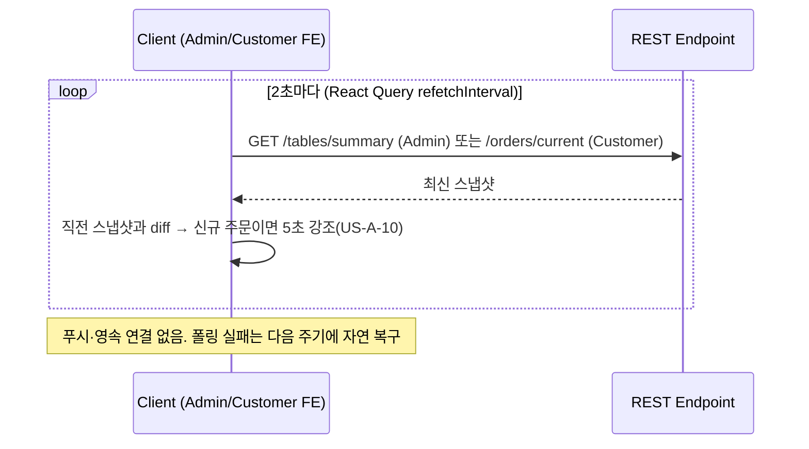
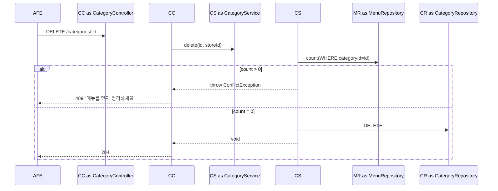
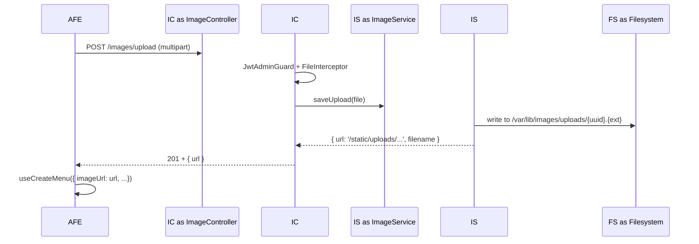

# Services — 서비스 정의 및 오케스트레이션

본 문서는 **Backend 서비스 레이어(NestJS Service)**의 책임 / 의존 / 오케스트레이션 패턴을 정의합니다. (Frontend는 React Query hook + Zustand store가 사실상의 service layer 역할을 하므로 별도 섹션에서 다룹니다.)

---

## 1. Backend Service 책임 매트릭스

| Service | Domain Ownership | 협력자 (의존) | 트랜잭션 경계 |
|---|---|---|---|
| **AuthService** | AdminUser 인증, JWT/Table Token 발급·검증 | AdminUserRepository, TableRepository, JwtService, BcryptHelper | 단일 read·write |
| **StoreService** | Store 마스터 조회 | StoreRepository | read-only |
| **CategoryService** | Category CRUD + sortOrder | CategoryRepository, MenuRepository (delete 차단) | 단일 트랜잭션 |
| **MenuService** | Menu CRUD + sortOrder | MenuRepository, CategoryRepository (validate FK) | 단일 트랜잭션 |
| **ImageService** | 파일 저장·URL 발급 | Multer config, filesystem | none (idempotent file write) |
| **OrderService** | 주문 생성·조회·상태 변경·취소 | OrderRepository, OrderItemRepository, MenuRepository, SessionService, TableRepository | 다중 테이블 트랜잭션 (생성) / 상태변경·취소는 **비관적 락 트랜잭션** (동시 편집 원자성) |
| **SessionService** | TableSession 라이프사이클 | TableSessionRepository, OrderRepository | 단일 트랜잭션 |
| **TableService** | 대시보드 요약 집계 (폴링 대상) | TableRepository, SessionService, OrderRepository | read-only |

> **실시간 = 폴링**: 별도 RealtimeService/푸시 채널 없음. 클라이언트가 2초 주기로 위 read 엔드포인트를 재조회한다. (SSE → 폴링 다운그레이드, U8 GATE 설계 변경)

---

## 2. 핵심 오케스트레이션 시나리오

### 2.1 주문 생성 (가장 중요)

**Stories**: US-C-18, US-C-19, US-C-20, US-S-01, US-S-03

**핵심 룰**:
- `MenuService.findById` 로 단가·이름 검증 후 OrderItem에 **스냅샷** 저장 → 추후 메뉴 수정/삭제 영향 차단
- 트랜잭션 안에서 세션 생성 + 주문 생성 + 아이템 생성 (원자성)
- 푸시 없음 — Admin/Customer 화면은 폴링으로 갱신

### 2.2 주문 상태 변경 (Admin)

**Stories**: US-A-12

**동시성**: 폴링은 최대 2초 stale → 두 Admin이 같은 주문을 동시 편집할 수 있다. `SELECT ... FOR UPDATE` 로 read-modify-write를 직렬화하고, 락 안에서 정방향 전이를 재검증해 lost-update와 무효 전이를 차단한다. 충돌 측은 400을 받고 FE가 refetch로 실제 상태를 표시한다.

### 2.3 주문 취소 (soft-delete)

**Stories**: US-A-15, US-A-16, US-A-17

테이블 총액 재계산은 클라이언트가 다음 폴링(`/tables/summary`)에서 서버 재조회로 반영. 합계는 서버에서 `SUM(totalAmount) WHERE status != CANCELED AND sessionId = activeSession`.

### 2.4 세션 종료 (이용 완료)

**Stories**: US-A-18, US-A-19, US-S-02

세션 종료 후 Customer FE는 다음 폴링(`/orders/current`)에서 **테이블 토큰은 유지하되 현재 주문 조회가 빈 결과**가 됨(`endedAt IS NULL` 조건 false). 새 주문 발생 시 새 세션 자동 생성(2.1).

### 2.5 폴링 기반 갱신 (SSE 대체)

**Stories**: US-A-09, US-C-25

**설계 단순화**: SSE(RealtimeService/SseController/ring buffer/Last-Event-ID)를 전면 제거하고 폴링으로 대체. 푸시 인프라/재연결/이벤트 카탈로그가 사라져 운영 부담이 감소한다. 트레이드오프 = 최대 2초 지연 + 폴링 트래픽(단일 매장 ≤5 클라이언트라 무시 가능).

### 2.6 카테고리 삭제 (참조 무결성)

**Stories**: US-A-31

### 2.7 메뉴 이미지 업로드

**Stories**: US-A-33, US-A-34

리사이징·최적화 없음 (constraints).

---

## 3. Frontend Service Layer (앱별 요약)

### 3.1 Customer FE

| 책임 | 구현 |
|---|---|
| 인증 토큰 관리 | `src/lib/auth.ts` (localStorage wrapper) |
| API 호출 | React Query hooks (`src/lib/queries/*`) |
| 실시간 갱신 | React Query `useCurrentOrders` `refetchInterval: 2000` (폴링) |
| 장바구니 상태 | Zustand `cart-store` with persist middleware |
| 라우팅 보호 | App Router middleware/layout에서 `isTableAuthenticated()` 체크 → redirect |

### 3.2 Admin FE

| 책임 | 구현 |
|---|---|
| JWT 토큰 관리 | Zustand `auth-store` + persist |
| API 호출 | React Query hooks |
| 실시간 대시보드 | `useDashboard` `refetchInterval: 2000` (폴링) + 폴링 diff로 신규 주문 강조 |
| 라우팅 보호 | `(dashboard)/layout.tsx` 에서 토큰 검증, 미인증 시 `/login` |

---

## 4. 트랜잭션·일관성 규칙

| 시나리오 | 트랜잭션 범위 | 비고 |
|---|---|---|
| 주문 생성 | Session(create-if-absent) + Order + OrderItems | 단일 TX |
| 주문 상태 변경 | Order 1행 SELECT FOR UPDATE + UPDATE | 단일 TX (비관적 락 — 동시 편집 직렬화) |
| 주문 취소 | Order 1행 SELECT FOR UPDATE + UPDATE | 단일 TX (비관적 락) |
| 세션 종료 | TableSession 1행 UPDATE | 단일 TX |
| 카테고리 삭제 | Menu count 조회 + Category 삭제 | SELECT FOR UPDATE 또는 동일 트랜잭션 |
| 카테고리 / 메뉴 reorder | 다수 row UPDATE | 단일 TX |
| 이미지 업로드 | DB 없음 (파일시스템) | non-transactional. 메뉴 등록 실패 시 orphan 파일 가능 — MVP 허용, 후속 cleanup job |

---

## 5. 보안 / Guard 적용 패턴

| Guard | 위치 | 책임 |
|---|---|---|
| `JwtAdminGuard` | Admin 전용 라우트 | `Authorization: Bearer` 추출 → AuthService.validateAdminToken → request에 admin payload 주입 |
| `TableTokenGuard` | Customer 전용 라우트 | 동일 패턴, table payload 주입 |
| `OptionalAuthGuard` | 카테고리/메뉴 read (`GET /categories`, `GET /menus`, `GET /menus/by-category/:id`) | Admin/Table 토큰이 있으면 `req.admin`/`req.table` 주입, 없으면 통과. 컨트롤러가 `admin?.storeId ?? table?.storeId ?? getCurrent()` 로 store 결정 → admin은 자기 매장, **고객(테이블 토큰)은 자기 매장**, 익명은 기본 매장 |

데코레이터: `@CurrentAdmin()`, `@CurrentTable()` 로 컨트롤러에서 payload 추출.

---

## 6. 에러 처리 패턴

| 레이어 | 패턴 |
|---|---|
| Service | 도메인 예외 (NestJS `BadRequestException`, `NotFoundException`, `ConflictException`, `UnauthorizedException`) throw |
| Controller | NestJS 내장 ExceptionFilter가 자동 변환 |
| Global Filter | `HttpExceptionFilter` 로 응답 포맷 통일: `{ error: { code, message, details? } }` |
| FE | React Query `onError` + Toast / 인라인 메시지 |

---

## 7. 폴링 대상 엔드포인트 (SSE 카탈로그 대체)

푸시 이벤트 없음. 클라이언트가 2초 주기로 아래를 폴링하여 동일 효과를 얻는다.

| 폴링 엔드포인트 | 주체 | 주기 | 화면 반영 |
|---|---|---|---|
| `GET /tables/summary` | Admin 대시보드 | 2s | 카드 총액/미리보기 갱신 + 직전 대비 신규 주문이면 5초 강조 |
| `GET /tables/:id/current-orders` | Admin 상세 모달 | 2s | 진행 중 주문/상태 갱신 |
| `GET /orders/current` | Customer 주문 내역 | 2s | 상태 변경 반영 / 세션 종료 시 빈 결과 |

> 상태 변경·취소·세션 종료는 즉시 서버 반영되며, 타 클라이언트는 다음 폴링 주기(≤2초)에 동기화된다.
