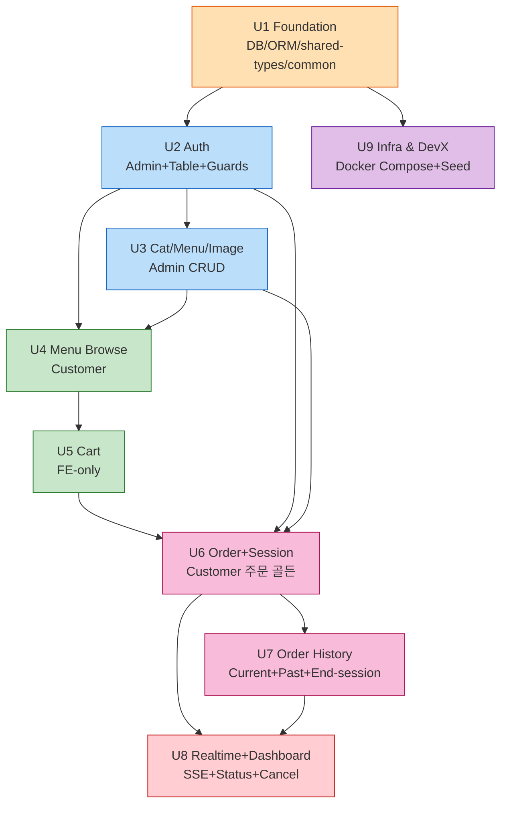
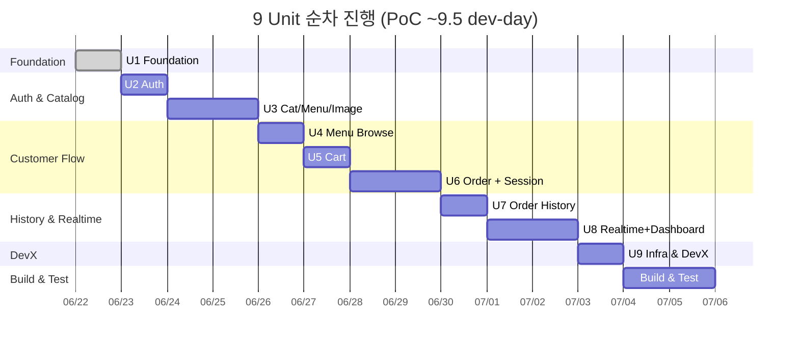

# Unit of Work — 의존 매트릭스 및 작업 순서

## 1. 의존 그래프

---

## 2. 의존 매트릭스

| / | U1 | U2 | U3 | U4 | U5 | U6 | U7 | U8 | U9 |
|---|---|---|---|---|---|---|---|---|---|
| **U1** | — | | | | | | | | |
| **U2** | ✅ | — | | | | | | | |
| **U3** | ✅ | ✅ | — | | | | | | |
| **U4** | ✅ | ✅ | ✅ | — | | | | | |
| **U5** | ✅ | ✅ | ✅ | ✅ | — | | | | |
| **U6** | ✅ | ✅ | ✅ | ✅ | ✅ | — | | | |
| **U7** | ✅ | ✅ | ✅ | ✅ | ✅ | ✅ | — | | |
| **U8** | ✅ | ✅ | ✅ | ✅ | ✅ | ✅ | ✅ | — | |
| **U9** | ✅ | | | | | | | | — |

(전이적 의존 포함)

순환 의존 **없음**.

---

## 3. 작업 진행 순서 (Q3=A 순차)

사용자 선택은 **순차 진행**입니다. 의존 그래프의 topological order에 따라 다음과 같이 진행합니다.

### 순서

| Step | Unit | 의존 충족 | 비고 |
|---|---|---|---|
| 1 | **U1** Foundation | (없음) | 시작 |
| 2 | **U2** Auth | U1 ✓ | |
| 3 | **U3** Cat/Menu/Image | U1, U2 ✓ | |
| 4 | **U4** Menu Browse | U1, U2, U3 ✓ | |
| 5 | **U5** Cart | U4 ✓ | |
| 6 | **U6** Order + Session | U1, U2, U3, U4, U5 ✓ | 핵심 골든 플로우 |
| 7 | **U7** Order History | U6 ✓ | |
| 8 | **U8** Realtime + Dashboard | U6, U7 ✓ | 최복잡 |
| 9 | **U9** Infra & DevX | U1 ✓ | 마지막에 통합 (또는 U1 직후 부분 작성 가능) |

### Gantt 시각화 (대략)

### 참고: 병렬 가능성 (Q3 변경 시)
사용자는 순차를 선택했지만, 만약 병렬을 적용한다면 가능한 조합:
- **U9** Infra & DevX는 U1 직후 다른 Unit들과 병렬 가능
- **U4 + U5** Cart는 U3 완료 후 일부 병렬 가능 (Cart는 FE-only이라 BE 의존 적음)
- **U7 + U8**은 모두 U6에 의존하므로 U6 완료 후 가능

본 문서는 사용자 결정(순차)에 따라 위 표 순서를 권장합니다.

---

## 4. Unit 경계 인터페이스

각 Unit이 다른 Unit에 노출하는 **계약(인터페이스)**:

| Unit | 노출 인터페이스 | 소비자 |
|---|---|---|
| **U1** | TypeORM Entity 클래스(Store/AdminUser/Table/Category/Menu/TableSession/Order/OrderItem), shared-types DTO/enum/event, 글로벌 Filter/Pipe/Interceptor, `@CurrentAdmin()`/`@CurrentTable()` 데코레이터 | 모든 Unit |
| **U2** | AuthService.adminLogin/setupTable/validate*, JwtAdminGuard, TableTokenGuard, REST `/auth/*` | U3, U6, U7, U8 (Guard 사용) |
| **U3** | CategoryService, MenuService(read), ImageService, REST `/categories`, `/menus`, `/images/upload` | U4 (메뉴 조회), U6 (주문 시 메뉴 가격 검증), U7 (이력에서 메뉴 정보), U8 (실시간 표시) |
| **U4** | Customer FE 메뉴 화면 컴포넌트, useMenusByCategory hooks | U5 (장바구니 추가 진입점) |
| **U5** | Zustand cart-store(items/add/remove/setQuantity/clear/total), localStorage persist | U6 (주문 확정 시 cart → orderItems 변환) |
| **U6** | OrderService.create, SessionService.ensureActiveSession/findActive, REST `POST /orders` | U7 (현재 세션 조회), U8 (상태 변경/취소 전제) |
| **U7** | OrderService.listCurrentBySession/listHistoryByTable, SessionService.end/listEnded, REST `/orders/current`, `/tables/:id/history`, `/tables/:id/end-session` | U8 (테이블 카드 표시는 현재 세션 데이터 사용) |
| **U8** | RealtimeService publish/subscribe, SSE 채널, OrderService.changeStatus/cancel/listByStore, REST `/sse/stream`, `/orders` (admin), `/orders/:id/status`, `/orders/:id`, `/tables` | (외부 — 양 FE가 직접 소비) |
| **U9** | docker-compose.yml, seed scripts, npm scripts, README | 운영자/개발자 |

---

## 5. 변경 시 영향 매트릭스

Unit 변경 시 후속 Unit 영향:

| 변경 발생 Unit | 영향받을 가능성 있는 Unit |
|---|---|
| U1 (Entity 스키마 변경) | 거의 전부 (U2~U8) |
| U2 (Guard/Token 포맷 변경) | U3, U6, U7, U8 (보호 라우트 / 클라이언트 토큰 처리) |
| U3 (Menu/Category 스키마) | U4, U6 (가격 스냅샷), U7, U8 |
| U6 (Order DTO/transaction 경계) | U7, U8 (SSE 페이로드, 이력 조회) |
| U8 (SSE 이벤트 스키마) | U6/U7의 publish 코드, FE의 subscribe 코드 |

---

## 6. Risk 매트릭스

| Unit | 잠재 Risk | 완화 |
|---|---|---|
| U6 | 트랜잭션 안에서 SSE publish하면 rollback ghost | publish는 commit 이후로 명시 (services.md §2.1) |
| U6 | Menu 가격 스냅샷 누락 → 추후 메뉴 변경이 과거 주문에 영향 | OrderItem 스키마에 `menuNameSnapshot`/`unitPriceSnapshot` 명시 |
| U7 | 세션 종료 시 누적 주문 누락 가능 | 세션 종료 트랜잭션 + `endedAt IS NULL` 인덱스 |
| U8 | SSE 연결 끊김 시 이벤트 유실 | exponential backoff + Last-Event-ID + ring buffer (best-effort) |
| U8 | EventEmitter는 in-process — Backend 재시작 시 구독 끊김 | 클라이언트 자동 재연결로 처리, MVP 허용 |
| U9 | Image volume 미장착 시 컨테이너 재배포 시 이미지 유실 | docker-compose에 named volume 명시 |
