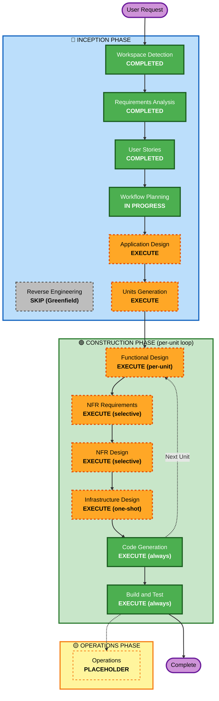

# Execution Plan — 테이블오더 서비스

**Project Type**: Greenfield
**Created**: 2026-06-19
**Status**: Pending Approval
**Inputs**: requirements.md / stories.md / personas.md / aidlc-state.md

---

## 1. Detailed Analysis Summary

### 1.1 Transformation Scope
- **Type**: New Greenfield system (transformation N/A)
- **Primary Changes**: Customer FE + Admin FE + Backend + DB 신규 구축
- **Related Components**: 없음 (Greenfield)

### 1.2 Change Impact Assessment

| Impact Area | Yes/No | Description |
|---|---|---|
| **User-facing changes** | ✅ Yes | 두 페르소나(Customer/Admin), 두 FE 앱 신규 |
| **Structural changes** | ✅ Yes | 전체 시스템 신규 (3-tier: FE / BE / DB) |
| **Data model changes** | ✅ Yes | Store, Table, User, Category, Menu, Order, OrderItem, Session 모델 신규 |
| **API changes** | ✅ Yes | REST + SSE 엔드포인트 전체 신규 |
| **NFR impact** | ✅ Yes | 성능(≤2s SSE), 보안(bcrypt+JWT), 가용성(트랜잭션·재연결) |

### 1.3 Application Layer Impact
- **Code changes**: 전체 신규 (Customer FE, Admin FE, NestJS Backend)
- **Dependencies**: Next.js 14, NestJS, TypeORM/Prisma, MySQL 드라이버, bcrypt, jsonwebtoken, multer, next-intl, Playwright, Jest, Testcontainers
- **Configuration**: `.env`, docker-compose.yml, tsconfig, ESLint/Prettier
- **Testing**: Unit (Jest) + Integration (Jest + Supertest + Testcontainers) + E2E (Playwright)

### 1.4 Infrastructure Layer Impact
- **Deployment model**: Docker Compose 단일 머신
- **Services**: customer-fe (Next.js), admin-fe (Next.js), backend (NestJS), mysql (8.x), 정적 이미지 볼륨
- **Networking**: 단일 내부 Docker 네트워크, 호스트 포트 매핑
- **Storage**: MySQL 볼륨 + 이미지 업로드 볼륨

### 1.5 Operations Layer Impact
- **Monitoring**: 구조화 JSON 로그(NFR-OBS-01) — Datadog/cloud-grade는 OFF (Resiliency OFF)
- **Logging**: stdout JSON, docker logs
- **Alerting**: MVP 범위 없음
- **Deployment**: docker-compose up

### 1.6 Risk Assessment

| 항목 | 등급 | 비고 |
|---|---|---|
| **Risk Level** | **Low~Medium** | Greenfield PoC + 의도된 단순화, 다만 SSE/세션 트랜잭션은 careful design 필요 |
| **Rollback Complexity** | **Easy** | Docker 컨테이너 재시작/이전 이미지 복원 |
| **Testing Complexity** | **Moderate** | Unit+Integration+E2E 전 레이어 작성 |

---

## 2. Workflow Visualization

---

## 3. Phases to Execute

### 🔵 INCEPTION PHASE
- [x] **Workspace Detection** — COMPLETED
- [x] **Reverse Engineering** — SKIPPED (Greenfield, no existing code)
- [x] **Requirements Analysis** — COMPLETED (requirements.md 작성)
- [x] **User Stories** — COMPLETED (64 stories + 2 personas)
- [x] **Workflow Planning** — IN PROGRESS (이 문서)
- [ ] **Application Design** — **EXECUTE**
  - **Rationale**: 신규 시스템으로 컴포넌트/서비스/모듈 식별 필요. Customer FE / Admin FE / Backend 모듈 구조, 도메인 엔티티(Store/Table/Order/Session 등), 서비스 레이어 책임 정의 필요. 후속 Units Generation의 입력
- [ ] **Units Generation** — **EXECUTE**
  - **Rationale**: 64개 user story를 6~9개 implementable Unit으로 분할 필요. Epic(C1~C5, A1~A6)을 기반으로 Unit 매핑. 각 Unit 의 책임/계약/의존 명시

### 🟢 CONSTRUCTION PHASE (per-unit loop)
- [ ] **Functional Design** (per-unit) — **EXECUTE (selective)**
  - **Rationale**: 비즈니스 로직 복잡도 있는 Unit(테이블 세션 라이프사이클, 주문 상태 전이, SSE 이벤트)은 EXECUTE. 단순 CRUD Unit(카테고리/메뉴 관리)은 minimal depth
- [ ] **NFR Requirements** (per-unit) — **EXECUTE (selective)**
  - **Rationale**: 성능/보안 요구사항 있는 Unit(인증, SSE, 주문 생성)은 EXECUTE. 순수 CRUD Unit은 SKIP 또는 minimal
- [ ] **NFR Design** (per-unit) — **EXECUTE (selective)**
  - **Rationale**: NFR Requirements를 실행한 Unit에 한해 적용
- [ ] **Infrastructure Design** — **EXECUTE (one-shot)**
  - **Rationale**: Unit별이 아닌 전체 1회 — Docker Compose 토폴로지, 볼륨, 네트워크, 환경변수 설계. 매 Unit마다 반복 불필요
- [ ] **Code Generation** (per-unit) — **EXECUTE (ALWAYS)**
  - **Rationale**: 모든 Unit에 대해 Planning(체크리스트) → Generation(실제 코드)
- [ ] **Build and Test** — **EXECUTE (ALWAYS)**
  - **Rationale**: 전체 Unit 완료 후 빌드 + 단위·통합·E2E 테스트

### 🟡 OPERATIONS PHASE
- [ ] **Operations** — **PLACEHOLDER**
  - **Rationale**: 현재 워크플로우 범위 외, 후속 확장

---

## 4. Stage Execution Depth Map

| Stage | Depth | 사유 |
|---|---|---|
| Application Design | **Standard** | 도메인 명확, 단일 매장 MVP — Overkill 회피 |
| Units Generation | **Standard** | Epic 단위 자연스러운 분할 가능 |
| Functional Design | **Standard for complex / Minimal for simple** | 세션·SSE·주문 상태 복잡 / CRUD 단순 |
| NFR Requirements | **Standard** (선택적 Unit) | 핵심 성능·보안만 |
| NFR Design | **Minimal** | Resiliency baseline OFF → 패턴 최소 |
| Infrastructure Design | **Minimal** | Docker Compose 1개 파일 + volume + .env |
| Code Generation | **Standard** | Production-quality code, but PoC scope |
| Build and Test | **Comprehensive** | Unit+Integration+E2E 모두 (Q15=A) |

---

## 5. Estimated Plan Structure

### 5.1 Unit Decomposition Preview (Units Generation에서 확정)

stories.md Epic을 기반으로 한 잠정 Unit 분할(약 7~9 Units):

| Unit (잠정) | 포함 Epic / Story | 비고 |
|---|---|---|
| **U1: Shared Foundation** | DB schema, ORM 모델, 공통 유틸, error 핸들러 | 다른 Unit이 의존 |
| **U2: Auth (Admin + Table)** | A1 (US-A-01~06), C1 (US-C-01~05) | JWT, bcrypt, 토큰 발급 |
| **U3: Category & Menu Management** | A5 (US-A-28~32), A4 (US-A-23~27), A6 (US-A-33~34) | Admin CRUD + 업로드 |
| **U4: Menu Browsing (Customer)** | C2 (US-C-06~10) | Customer 메뉴 조회 |
| **U5: Cart (Customer FE-only)** | C3 (US-C-11~16) | FE localStorage 로직 |
| **U6: Order Submission & Session** | C4 (US-C-17~21), US-S-01, US-S-03 | 주문 생성 + 세션 자동 시작 |
| **U7: Order History (Customer + Admin)** | C5 (US-C-22~25), A3 부분(US-A-20~22), US-S-02 | 세션 종료 후 이력 |
| **U8: Realtime Dashboard & Status** | A2 (US-A-07~13), A3 부분(US-A-14~19), US-S-04, US-S-05 | SSE, 상태 변경, soft-delete |
| **U9: Infra & DevX** | Docker Compose, .env, README, scripts | 1회성 |

→ Units Generation 단계에서 의존 순서·계약(API)·테스트 매트릭스 확정

### 5.2 Estimated Duration (가이드)

| Phase | 추정 |
|---|---|
| Application Design | 0.5일 (1 세션) |
| Units Generation | 0.5일 |
| Construction (per-unit × 9) | Unit당 0.5~1일 → 약 6~9일 |
| Build and Test (전체) | 1~2일 |
| **합계** | **~10~14 dev-day** (PoC 기준, 1 dev 가정) |

---

## 6. Success Criteria

### 6.1 Primary Goal
**테이블 태블릿에서 고객이 메뉴를 주문하고, 매장 운영자가 실시간 대시보드에서 주문을 모니터링·관리할 수 있는 단일 매장 MVP 시스템을 Docker Compose로 띄울 수 있다.**

### 6.2 Key Deliverables
- [ ] `customer-fe/` Next.js 14 앱 (메뉴/장바구니/주문/내역)
- [ ] `admin-fe/` Next.js 14 앱 (인증/대시보드/테이블/메뉴/카테고리)
- [ ] `backend/` NestJS 앱 (REST + SSE + Auth + DB)
- [ ] `docker-compose.yml` + `.env.example` + 볼륨 설정
- [ ] DB 마이그레이션 + seed 스크립트
- [ ] 단위 테스트 (Jest)
- [ ] 통합 테스트 (Supertest + Testcontainers)
- [ ] E2E 테스트 (Playwright, 핵심 플로우 3~5개)
- [ ] OpenAPI/Swagger 문서
- [ ] README + 실행 가이드

### 6.3 Quality Gates

| Gate | 기준 |
|---|---|
| **G1: 타입 검사** | TypeScript strict 모드 통과 (FE + BE) |
| **G2: Lint** | ESLint/Prettier 통과 |
| **G3: 단위 테스트** | 핵심 도메인 로직(주문 합계, 세션 전이, 인증) 통과 |
| **G4: 통합 테스트** | 모든 API 엔드포인트 통과 |
| **G5: E2E 핵심 플로우** | Customer 주문 골든 플로우 / Admin 모니터링 / 세션 종료 통과 |
| **G6: 빌드** | `docker-compose up` 성공 + 모든 컨테이너 healthy |
| **G7: 성능 spot check** | 신규 주문 → Admin 표시 ≤ 2초 (수동 측정) |

---

## 7. Adaptive Notes

- Application Design / Units Generation 결과에 따라 Unit 수 / 의존 순서가 변경될 수 있음
- 진행 중 의도적 단순화가 필요하면 사용자 확인 후 plan 보정
- Extension(Security/Resiliency/PBT) 모두 OFF — Construction phase 게이트에 N/A 처리

---

## 8. Approval Request

본 plan을 **승인**해주시면 다음 단계 **Application Design**으로 진행합니다.

수정 요청 사항이 있으시면 어떤 단계를 추가/제거/변경할지 알려주세요. (예: "Infrastructure Design은 Code Generation 이후로", "Application Design은 minimal depth만" 등)
